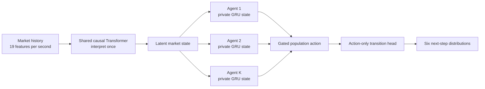
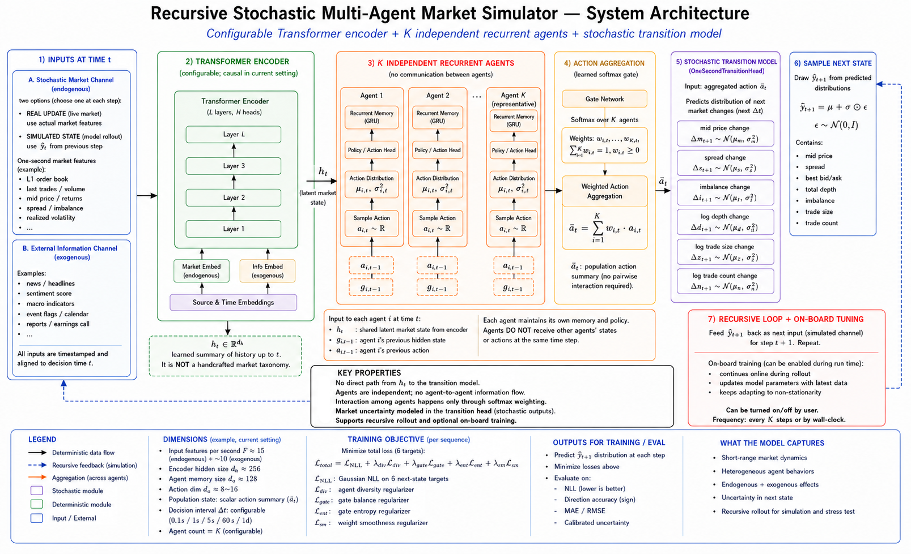
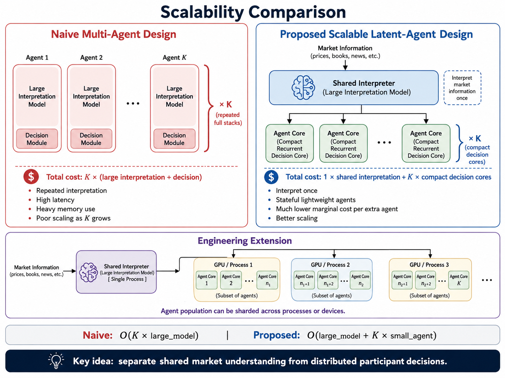
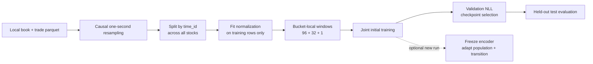
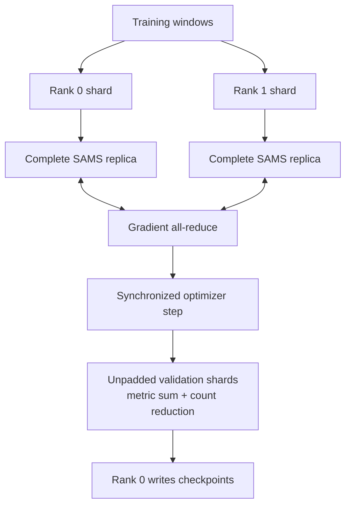
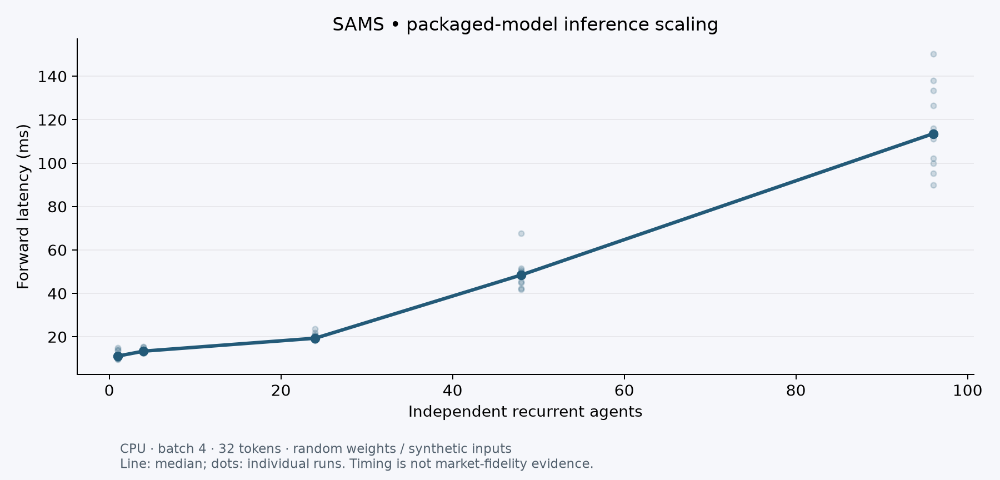
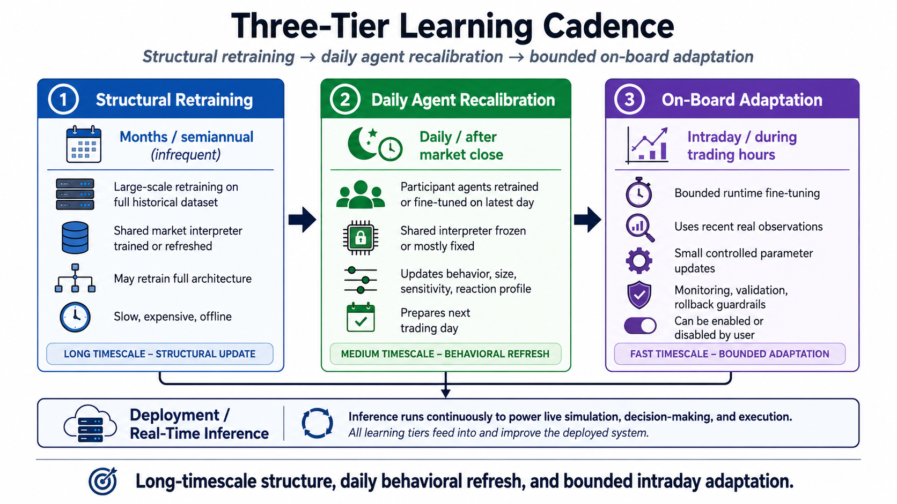
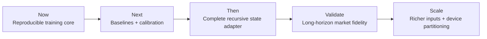

<div align="center">

<h1> SAMS</h1>
### Scalable Latent-Agent Market Simulator

**Interpret the market once. Let a population respond. Learn the next transition.**

[**alpha_model ↗**](https://pittsai.com/sams) · [Research report](Scalable-Latent-MultiAgent-Market-Simulator.pdf) · [Architecture](docs/ARCHITECTURE.md) · [Training guide](docs/TRAINING.md) · [Roadmap](docs/ROADMAP.md)

</div>

---

SAMS explores a market-modeling architecture in which one causal encoder interprets the observed market, a population of independently parameterized recurrent agents responds to that shared state, and an action-only transition head predicts the next market changes.

The central question: **can heterogeneous latent participants provide a scalable, useful representation of market dynamics without repeating expensive market interpretation for every agent?**

This repository contains the research notebook and report, an installable PyTorch implementation, offline data preparation, initial training, encoder-frozen adaptation, held-out evaluation, and distributed correctness tests.

> **Research status.** The packaged system trains next-step distributions on observed histories. Validated autonomous market rollouts, economically identified agent types, and production trading performance remain open research goals. The online demo illustrates the project; it is not a benchmark result.

## The architecture at a glance



There is no same-step agent-to-agent messaging. Each agent has its own recurrent parameters, hidden state, and previous action. The transition head receives only the weighted population action: it cannot bypass the population by reading the shared latent directly.

### Inside the system

<p align="center">
  <a href="docs/assets/system-architecture.png"></a>
</p>

Read the diagram from left to right:

1. **Interpret the market.** A shared causal Transformer summarizes observed market history into a latent state.
2. **Form participant responses.** Independent recurrent agents combine that shared state with their own memory and previous action to produce stochastic latent actions.
3. **Aggregate and predict.** A learned softmax gate combines the actions; the transition head predicts six next-step target distributions.
4. **Close the loop — planned.** The dashed feedback path describes the intended recursive simulator, with future external inputs and bounded on-board adaptation.

*This research schematic includes proposed extensions and illustrative dimensions. The packaged reference uses 19 market features, encoder width 128, agent hidden width 64 and action dimension 4. Its objective includes NLL, diversity and gate balance; the additional entropy/smoothness terms shown are not implemented. See [the architecture guide](docs/ARCHITECTURE.md) for the current specification. Click the figure to read it at full resolution.*

## Where the design helps

<p align="center">
  <a href="docs/assets/scalability-comparison.png"></a>
</p>

*Design rationale: share market interpretation and grow the compact participant population. The bottom “Engineering Extension” shows proposed agent sharding; current distributed training uses complete-model DDP replicas. News ingestion is also planned. The cost comparison is conceptual, not a measured speedup.*

| Design choice | What it enables | What it does not establish |
|---|---|---|
| One market encoder for the population | Avoids K repeated encoder evaluations | End-to-end runtime still grows with agent count |
| Vectorized independent GRUs | Batched heterogeneous recurrent responses | Agents are not automatically identifiable as human trader types |
| Stochastic latent actions | A learnable distribution of participant responses | Actions are not exchange orders or executable strategies |
| Action-only transition head | Forces predictions through the population bottleneck | Does not prove causal identification |
| Separate encoder and population | A runnable encoder-frozen adaptation stage | Daily scheduling and safe online adaptation are still future work |
| Standard PyTorch DDP | Data-parallel training across processes | Agents are not partitioned across devices |

For encoder cost **E** and per-agent cost **A**, the architectural motivation is approximately **E + K·A**, versus **K·E + K·A** for repeated independent encoders. This is a compute decomposition, not a measured speedup guarantee.

## Try it in a few minutes

Python 3.11+ is required. The example generates synthetic book/trade observations locally; no credentials or market-data download is needed.

```bash
git clone https://github.com/Yunfan-Wang/Scalable-MultiAgent-Market-Simulator.git
cd Scalable-MultiAgent-Market-Simulator
python -m venv .venv
# macOS / Linux:
source .venv/bin/activate
# Windows PowerShell instead:
# .venv\Scripts\Activate.ps1
python -m pip install -e ".[dev]"

python -m sams.synthetic --output data/smoke.parquet
python -m sams.pretrain --config configs/smoke.yaml --data data/smoke.parquet --output runs/smoke --device cpu --max-steps 2
python -m sams.evaluate --checkpoint runs/smoke/best.pt --data data/smoke.parquet --output runs/smoke/test.json --device cpu
python -m pytest -q
```

This checks the full software path with **two training steps per epoch**, not model quality. Validation still covers the full validation split. Use a fresh output directory when repeating a run.

Outputs include:

```text
runs/smoke/
├── manifest.json   # configuration, environment, data hash, Git state
├── metrics.jsonl   # validation metrics after each epoch
├── latest.pt       # epoch-boundary resume state
├── best.pt         # lowest validation NLL checkpoint
└── test.json       # held-out metrics from the evaluation command
```

For a specific CPU or CUDA build, install the appropriate PyTorch wheel before the editable package.

## Train on market data

The implemented input adapter uses **Optiver Realized Volatility Prediction** book and trade parquet partitions. Supply locally obtained data under its applicable terms; data and credentials are not distributed here.

```bash
python -m sams.prepare --book-dir data/raw/book_train.parquet --trade-dir data/raw/trade_train.parquet --output data/optiver.parquet
python -m sams.pretrain --config configs/pretrain.yaml --data data/optiver.parquet --output runs/pretrain --device cuda
```

The reference architecture uses a 4-layer, 128-dimensional causal Transformer, 24 independent GRUs with 64-dimensional state, and 4-dimensional latent actions. Each sequence contains **96 warmup + 32 supervised + 1 alignment rows**.



See [the data contract](docs/DATA.md) for all feature/target names, split semantics, and the correction to the dataset name used in the presentation. See [training](docs/TRAINING.md) for resume and adaptation commands.

## Distributed training and tests

Each process owns a complete model and a disjoint training-data shard. DDP averages gradients; evaluation shards are unpadded so no examples are double-counted across ranks.

```bash
# Two CPU processes; Linux is the CI target for torchrun.
torchrun --standalone --nproc_per_node=2 -m sams.pretrain --config configs/smoke.yaml --data data/smoke.parquet --output runs/ddp-smoke --device cpu --max-steps 2

# Two GPUs, one process per GPU.
torchrun --standalone --nproc_per_node=2 -m sams.pretrain --config configs/pretrain.yaml --data data/optiver.parquet --output runs/ddp-pretrain --device cuda

# Real two-process Gloo test, including gradient synchronization.
python -m pytest -q -m distributed

# Portable local CPU training smoke (also works around Windows TCPStore limits).
python scripts/distributed_smoke.py --data data/smoke.parquet --output runs/ddp-local
```



[Distributed guide →](docs/DISTRIBUTED.md)

## Measurement, not just diagrams

Benchmark the **actual packaged model** with synthetic inputs and random weights:

```bash
python scripts/benchmark.py --device cpu --agents 1 4 24 48 96 --output benchmarks/results/local.json
python -m pip install -e ".[plots]"
python scripts/plot_benchmark.py --input benchmarks/results/local.json --output docs/assets/local-scaling.png
```



The chart above is a local software benchmark, not a fidelity or GPU-throughput result. Its exact environment, raw timings, dimensions, and warmup count are in [the checked-in measurement](benchmarks/results/cpu-reference.json). Rerun on your hardware before comparing.

Historical scaling scripts and their original measurements are retained in [benchmarks/legacy](benchmarks/legacy). They use simplified benchmark architectures and are **not** interchangeable with measurements of the packaged model. Hardware provenance is incomplete; historical speedups are not promoted as current performance claims.

## What is implemented?

| Capability | Status |
|---|---|
| Shared causal encoder + vectorized recurrent population | Implemented |
| Six-target Gaussian transition objective and population regularizers | Implemented |
| Offline parquet preparation, train-only normalization, bucket-local windows | Implemented |
| Joint initial training and frozen-encoder adaptation | Implemented |
| Versioned checkpoints, epoch resume, run manifests | Implemented |
| Teacher-forced held-out metrics and majority-direction baseline | Implemented |
| Two-process Gloo correctness test and DDP entry point | Implemented |
| GPU / multi-node scaling validation | Not established by the local CPU tests |
| Complete 19-feature recursive state reconstruction | Planned |
| Calibrated long-horizon autonomous market simulation | Planned |
| Event/news ingestion and agent-parallel device partitioning | Planned |

## Research roadmap

### Learning at three timescales

<p align="center">
  <a href="docs/assets/three-tier-learning.png"></a>
</p>

*Research vision: learn market structure slowly and update participant responses more frequently. Joint training and encoder-frozen adaptation are available today. Automated daily scheduling, bounded on-board updates, monitoring and rollback are planned; the figure's deployment and execution flow is a target design.*

### Next milestones



The [roadmap](docs/ROADMAP.md) defines acceptance criteria rather than promises. Priorities include persistence and non-agent baselines, agent-count ablations, uncertainty calibration, distribution shift, safe adaptation, and reproducible multi-device measurements.

## Repository map

```text
src/sams/       Model, data contract, preprocessing, objectives, training, evaluation
configs/        Reference architecture, participant adaptation, small CPU smoke run
scripts/        Training/data/evaluation entry points and reproducible benchmarks
tests/          Model invariants, leakage checks, checkpoints, real Gloo collectives
docs/           Architecture, data, training, distributed execution, roadmap
benchmarks/     Packaged-model measurements and historical experiments
ExampleCode/    Original notebook, execution wrapper, and research catalogue
.github/        CI for lint, tests, packaging, and distributed smoke training
```

The original notebook and report remain available as research artifacts. The packaged path deliberately improves split handling and initial-value leakage prevention, and uses an epoch cosine scheduler; it is not a claim of bit-for-bit reproduction of the notebook's training results.

[Contributing](CONTRIBUTING.md) · [Reproducibility and limitations](docs/REPRODUCIBILITY.md) · [Local validation record](docs/VALIDATION.md)

No software license has been selected in this repository. A license grant should be added before inviting reuse under open-source terms.
